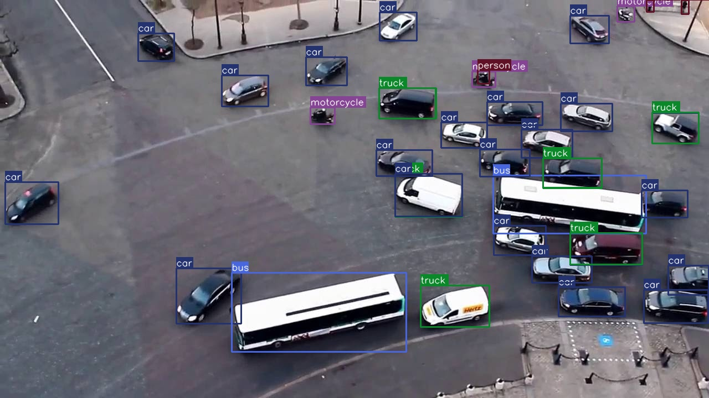

tinygrad implementation of: https://github.com/roboflow/rf-detr (inference)



## Setup:
```
pip install -r requirements.txt
```

## Inference on single image:
```
python rfdetr.py {link to an image} {model variant}
```
e.g python rfdetr.py https://i.ytimg.com/vi/w0V4SK21UIE/hq720.jpg l

## Live WebGPU inference
```
python compile_to_webgpu.py
python -m http.server 8080
```
open localhost:8080

## Testing performance
```
PYTHONPATH=. python test/test_jit.py
```
### for faster inference use tinygrad's BEAM search:
```
PYTHONPATH=. BEAM=2 python test/test_jit.py
```
this will result in a longer initial run time as the searches are performed and cached. For visibility on the process use:
```
PYTHONPATH=. BEAM=2 DEBUG=2 python test/test_jit.py
```

# Speed (M3 Macbook Air)
## with BEAM=2:
| Model | Resolution | FPS |
|-------|------------|-----|
| nano | 384 | 38.01 |
| small | 512 | 21.95 |
| medium | 576 | 15.54 |
| large | 704 | 10.68 |

## without BEAM=2:
| Model | Resolution | FPS |
|-------|------------|-----|
| nano | 384 | 10.14 |
| small | 512 | 5.56 |
| medium | 576 | 4.15 |
| large | 704 | 2.37 |
